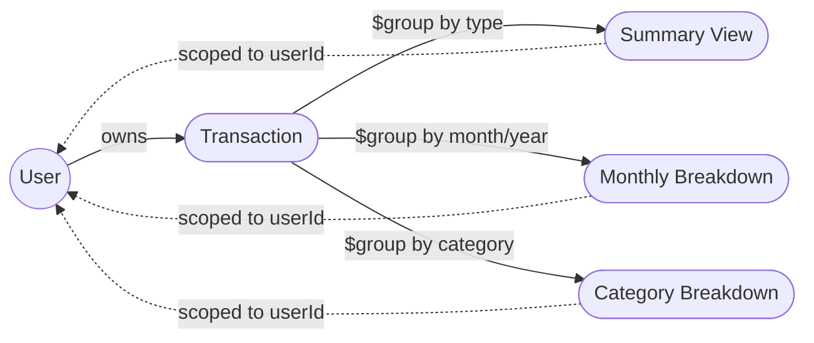
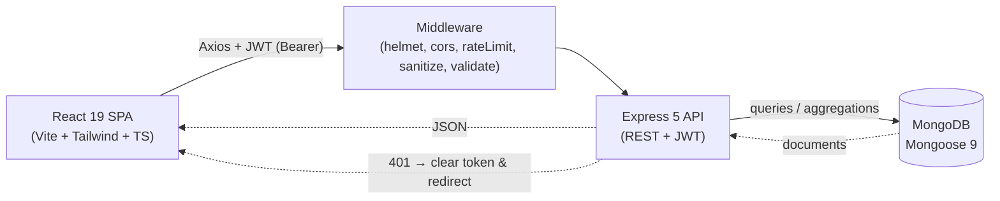

<div align="center">

  <p>
    <strong>💰 Expense Tracker MERN</strong>
  </p>

  <h1>Expense Tracker MERN</h1>

  <p><em>A full-stack personal finance tracker with JWT authentication, interactive Recharts dashboards, advanced filtering, server-side pagination, accessible modals, and a security-hardened Express API — built on a modern MERN architecture.</em></p>

  <p>
    
    
    
    
    
    
    
    
    
    
  </p>

  <p>
    <a href="https://expense-tracker-mernn.netlify.app/">Live Demo</a> •
    <a href="#features">Features</a> •
    <a href="#installation">Quick Start</a> •
    <a href="#api-endpoints">API Docs</a> •
    <a href="#architecture">Architecture</a>
  </p>

</div>

---

## Features

- **JWT Authentication** — Secure register, login, and session management with token-based auth and automatic 401 redirect
- **Transaction CRUD** — Create, read, update, and delete income and expense transactions with ownership isolation
- **Interactive Dashboard** — Summary cards showing income, expense, and net balance with real-time updates after CRUD operations
- **Data Visualization** — Monthly income vs. expense bar charts and category breakdown pie charts powered by Recharts, auto-refreshed after every CRUD action
- **Advanced Filtering** — Filter transactions by month, category, and type (income/expense) with instant results
- **Pagination** — Server-side pagination with frontend navigation and configurable limits (up to 100 per page)
- **Accessible Modals** — Focus trap, Escape key closure, ARIA attributes (`role="dialog"`, `aria-modal`), and body scroll locking
- **Responsive Design** — Mobile-first UI with collapsible sidebar, adaptive layouts, and touch-friendly targets (44px targets)
- **TypeScript** — Full frontend codebase in strict-mode TypeScript with shared type definitions
- **Single Source of Truth** — Categories and transaction types served from backend `/api/config` endpoint, eliminating frontend-backend duplication
- **Security Hardened** — Helmet, CORS whitelist, rate limiting, NoSQL injection prevention, HPP protection, and input sanitization
- **Form Validation** — Client-side and server-side validation with user-friendly error messages via express-validator
- **Backend Testing** — 32 integration tests covering auth and transaction CRUD with Jest, Supertest, and in-memory MongoDB
- **Code Quality** — ESLint + Prettier configured for both frontend and backend, DRY-compliant shared utilities
- **Toast Notifications** — Real-time feedback for all user actions using react-hot-toast

---

## Live Demo

[🚀 View Live Demo](https://expense-tracker-mernn.netlify.app/)

---

## Architecture

A high-level visual map of the system. Both diagrams render natively on GitHub thanks to Mermaid support.

### Domain Model

How the core collections relate to each other and how aggregation pipelines fan out into dashboard views.



### Request Lifecycle

How a single browser action travels through the stack.



---

## Technologies

### Frontend

- **React 19**: Modern UI library with hooks and context API for state management
- **TypeScript 5.9**: Type-safe development with strict configuration and shared type definitions
- **Vite 8**: Lightning-fast build tool and development server with HMR
- **Tailwind CSS 4**: Utility-first CSS framework for rapid, responsive styling
- **React Router 7**: Client-side routing with protected routes and layout nesting
- **Recharts 3**: Composable charting library for bar and pie chart visualizations
- **Axios 1.14**: Promise-based HTTP client with request/response interceptors
- **date-fns 4**: Lightweight date utility library for formatting and parsing
- **react-hot-toast 2**: Lightweight toast notification system
- **Heroicons 2**: Beautiful hand-crafted SVG icons from the Tailwind CSS team

### Backend

- **Node.js**: Server-side JavaScript runtime environment
- **Express 5**: Minimal and flexible web application framework
- **MongoDB (Mongoose 9)**: NoSQL database with elegant object modeling and aggregation pipelines
- **JWT (jsonwebtoken 9)**: Stateless authentication with token-based sessions
- **bcryptjs 3**: Secure password hashing with configurable salt rounds
- **Helmet 8**: HTTP security headers middleware
- **express-rate-limit 8**: Rate limiting middleware for API protection
- **express-validator 7**: Input validation and sanitization middleware
- **express-mongo-sanitize 2**: NoSQL injection attack prevention
- **hpp 0.2**: HTTP parameter pollution protection
- **dotenv 17**: Environment variable management
- **Swagger (swagger-jsdoc + swagger-ui-express)**: OpenAPI 3.0 interactive documentation
- **Jest 30 + Supertest 7**: Integration testing framework
- **mongodb-memory-server 11**: In-memory MongoDB for isolated test environments
- **ESLint 9 + Prettier**: Code linting and formatting

---

## Installation

### Prerequisites

- **Node.js** v18+ and **npm**
- **MongoDB** — [MongoDB Atlas](https://www.mongodb.com/cloud/atlas) (free tier) or local instance

### Local Development

**1. Clone the repository:**

```bash
git clone https://github.com/Serkanbyx/expense-tracker-mern.git
cd expense-tracker-mern
```

**2. Set up environment variables:**

```bash
cp server/.env.example server/.env
cp client/.env.example client/.env
```

**server/.env**

```env
PORT=5000
MONGO_URI=mongodb://localhost:27017/expense-tracker
JWT_SECRET=replace_with_a_strong_random_string_min_32_chars
JWT_EXPIRES_IN=7d
CLIENT_URL=http://localhost:5173
```

> Generate a strong JWT secret:
> `node -e "console.log(require('crypto').randomBytes(64).toString('hex'))"`

**client/.env**

```env
VITE_API_URL=http://localhost:5000/api
```

**3. Install dependencies:**

```bash
cd server && npm install
cd ../client && npm install
```

**4. Run the application:**

```bash
# Terminal 1 — Backend
cd server && npm run dev

# Terminal 2 — Frontend
cd client && npm run dev
```

The app will be available at `http://localhost:5173`.

**5. Run backend tests:**

```bash
cd server && npm test
```

---

## Usage

1. **Register** — Create a new account with your name, email, and password
2. **Login** — Sign in with your credentials to receive a JWT token
3. **Dashboard** — View summary cards (income, expense, net balance), monthly bar chart, category pie chart, and recent transactions
4. **Add Transaction** — Create new income or expense entries with amount, category, description, and date
5. **Filter & Browse** — Filter transactions by month, category, or type on the Transactions page
6. **Paginate** — Navigate through transaction pages using the pagination controls
7. **Edit / Delete** — Update or remove any transaction you own
8. **Logout** — End your session; token is cleared from local storage

---

## How It Works?

### Authentication Flow

1. User submits credentials via the Login or Register form
2. Server validates input with `express-validator`, hashes password with `bcryptjs` (12 salt rounds), and stores user in MongoDB
3. Server generates a JWT containing `{ userId }` and returns it alongside user data
4. Client stores the token in `localStorage` and attaches it to every subsequent request via an Axios request interceptor
5. On page reload, `AuthContext` bootstraps by calling `GET /api/auth/me` to verify the token
6. If any request returns 401, the Axios response interceptor clears storage and redirects to `/login`

### Data Flow

1. `TransactionContext` manages all transaction state (list, summary, monthly, categories, filters, pagination)
2. `ConfigContext` fetches categories and transaction types from `/api/config` on app load — single source of truth
3. When the user navigates to Dashboard or Transactions, context dispatches API calls via `transactionService.ts`
4. After any CRUD operation, a `dataVersion` counter increments, triggering automatic re-fetch of transactions, summary, **and dashboard charts** (monthly + category)
5. Server controllers run Mongoose aggregation pipelines (for summary, monthly, category breakdowns) scoped to `req.user._id`
6. Results flow back through context and render in Recharts components (`MonthlyChart`, `CategoryChart`) and list components

---

## API Endpoints

| Method | Endpoint | Auth | Description |
|--------|----------|------|-------------|
| GET | `/` | No | Welcome page with API info |
| GET | `/api-docs` | No | Swagger / OpenAPI documentation |
| GET | `/api/health` | No | Health check — returns `{ status, timestamp }` |
| GET | `/api/config` | No | App configuration (categories, types) |
| POST | `/api/auth/register` | No | Register a new user account |
| POST | `/api/auth/login` | No | Login and receive JWT token |
| GET | `/api/auth/me` | Yes | Get current authenticated user profile |
| GET | `/api/transactions` | Yes | List transactions with pagination and filters |
| GET | `/api/transactions/summary` | Yes | Get income, expense, and net balance totals |
| GET | `/api/transactions/monthly` | Yes | Get monthly breakdown for bar charts |
| GET | `/api/transactions/categories` | Yes | Get category breakdown for pie charts |
| GET | `/api/transactions/:id` | Yes | Get a single transaction by ID |
| POST | `/api/transactions` | Yes | Create a new transaction |
| PUT | `/api/transactions/:id` | Yes | Update an existing transaction |
| DELETE | `/api/transactions/:id` | Yes | Delete a transaction |

> Auth endpoints require `Authorization: Bearer <token>` header.
> Auth routes (`/api/auth/*`) are rate-limited to 20 requests per 15 minutes.
> All routes are globally rate-limited to 100 requests per 15 minutes.

---

## Project Structure

A clean monorepo layout with an explicit backend / frontend split. Each panel below is collapsible — expand the one you care about.

<details open>
<summary><b>Server</b> — Express 5 API</summary>

```
server/
├── src/
│   ├── app.js                       # Express app configuration
│   ├── index.js                     # Server entry point (env validation, DB, listen)
│   ├── config/
│   │   ├── swagger.js               # OpenAPI 3.0 specification
│   │   └── welcomePage.js           # Root welcome HTML page
│   ├── models/
│   │   ├── User.js                  # User schema with bcrypt hashing
│   │   └── Transaction.js           # Transaction schema with indexes
│   ├── controllers/
│   │   ├── authController.js        # register, login, getMe
│   │   ├── transactionController.js # CRUD + aggregation pipelines
│   │   └── configController.js      # App configuration endpoint
│   ├── routes/
│   │   ├── index.js                 # Central router + health check
│   │   ├── authRoutes.js            # Auth endpoints
│   │   ├── transactionRoutes.js     # Transaction endpoints
│   │   └── configRoutes.js          # Config endpoint
│   ├── middleware/
│   │   ├── auth.js                  # JWT verification middleware
│   │   ├── validate.js              # express-validator result handler
│   │   ├── errorHandler.js          # notFound + global error handler
│   │   └── validators/              # auth + transaction validation rules
│   ├── utils/
│   │   ├── generateToken.js         # JWT signing utility
│   │   └── verifyToken.js           # JWT verification utility
│   └── __tests__/                   # Jest + Supertest integration tests
├── jest.config.js
├── eslint.config.mjs
├── .prettierrc
├── .env.example
└── package.json
```

</details>

<details>
<summary><b>Client</b> — React 19 + Vite SPA (TypeScript)</summary>

```
client/
├── public/
│   └── _redirects                   # Netlify SPA routing
├── src/
│   ├── App.tsx                      # Router configuration + providers
│   ├── main.tsx                     # React entry point
│   ├── index.css                    # Tailwind CSS imports
│   ├── types/                       # Shared TypeScript interfaces
│   ├── constants/                   # Category/type style maps
│   ├── pages/                       # Home, Login, Register, Dashboard, Transactions
│   ├── components/
│   │   ├── ProtectedRoute.tsx       # Auth guard for private routes
│   │   ├── layout/                  # AppLayout, Navbar, Footer
│   │   ├── dashboard/               # SummaryCards, MonthlyChart, CategoryChart, RecentTransactions
│   │   ├── transactions/            # FilterBar, TransactionList, TransactionForm
│   │   └── ui/                      # Skeleton, EmptyState, ErrorMessage, FormField, Pagination
│   ├── context/                     # AuthContext, TransactionContext, ConfigContext
│   ├── hooks/                       # useMediaQuery, useModalA11y
│   ├── services/                    # api (Axios), transactionService, configService
│   └── utils/                       # capitalize, formatCurrency, validation
├── vite.config.ts
├── tsconfig.json
├── .env.example
└── package.json
```

</details>

<details>
<summary><b>Repository root</b> — governance & shared config</summary>

```
expense-tracker-mern/
├── client/          # → see Client panel above
├── server/          # → see Server panel above
├── .github/         # issue templates, PR template, governance docs
│   ├── ISSUE_TEMPLATE/
│   ├── PULL_REQUEST_TEMPLATE.md
│   ├── CODE_OF_CONDUCT.md
│   ├── CONTRIBUTING.md
│   └── SECURITY.md
├── .gitignore
├── LICENSE
└── README.md
```

</details>

---

## Security

- **Helmet** — Sets secure HTTP headers to protect against common web vulnerabilities (XSS, clickjacking, MIME sniffing)
- **CORS Whitelist** — Restricts API access to a single trusted origin (`CLIENT_URL`) with credentials support
- **Rate Limiting** — Global limit of 100 requests per 15 minutes; stricter 20 requests per 15 minutes on auth routes
- **Password Hashing** — Passwords hashed with bcryptjs using 12 salt rounds; never stored in plain text
- **JWT Expiry** — Tokens expire after a configurable duration (default 7 days)
- **NoSQL Injection Prevention** — `express-mongo-sanitize` strips `$` and `.` operators from request bodies
- **HPP Protection** — `hpp` middleware prevents HTTP parameter pollution attacks
- **Input Validation** — All inputs validated and sanitized server-side with `express-validator`
- **Body Size Limit** — JSON and URL-encoded payloads limited to 10KB to prevent payload attacks
- **Ownership Isolation** — Users can only access and modify their own transactions
- **Environment Validation** — Server exits at startup if required environment variables are missing
- **Client-side Token Handling** — Automatic token cleanup and redirect on 401 responses

---

## Deployment

### Backend — Render

1. Create a new **Web Service** on [Render](https://render.com)
2. Connect your GitHub repository
3. Configure the service:
   - **Root Directory:** `server`
   - **Build Command:** `npm install`
   - **Start Command:** `npm start`
4. Set environment variables in the Render dashboard:

| Variable | Value |
|----------|-------|
| `NODE_ENV` | `production` |
| `PORT` | `10000` |
| `MONGO_URI` | Your MongoDB Atlas connection string |
| `JWT_SECRET` | A cryptographically strong random string (min 32 chars) |
| `JWT_EXPIRES_IN` | `7d` |
| `CLIENT_URL` | `https://your-app.netlify.app` (no trailing slash or path) |

5. Set **Health Check Path** to `/api/health` for automatic monitoring
6. Deploy — Render will automatically build and start the server

> Free tier services spin down after 15 minutes of inactivity. The first request after spin-down may take 30–60 seconds.

### Frontend — Netlify

1. Create a new site on [Netlify](https://netlify.com) and connect your GitHub repository
2. Configure the build settings:
   - **Base Directory:** `client`
   - **Build Command:** `npm run build`
   - **Publish Directory:** `client/dist`
3. Set environment variables (Site settings → Environment variables):

| Variable | Value |
|----------|-------|
| `VITE_API_URL` | `https://your-api.onrender.com/api` |

4. SPA routing is handled automatically via `client/public/_redirects`
5. Deploy — Netlify will automatically build and deploy on every push

---

## Features in Detail

**Completed Features**

- ✅ User registration and login with JWT authentication
- ✅ Full CRUD operations for income and expense transactions
- ✅ Interactive dashboard with summary cards (auto-refresh after CRUD)
- ✅ Monthly income vs. expense bar chart (auto-refresh after CRUD)
- ✅ Category breakdown pie chart (auto-refresh after CRUD)
- ✅ Recent transactions overview on dashboard
- ✅ Advanced filtering by month, category, and type
- ✅ Server-side pagination with frontend navigation controls
- ✅ Responsive design with collapsible sidebar
- ✅ Shared Navbar and Footer across all public pages
- ✅ Toast notifications for all user actions
- ✅ Loading skeletons and empty state placeholders
- ✅ Comprehensive input validation (client + server)
- ✅ Security hardening (Helmet, rate limiting, sanitization)
- ✅ Full TypeScript migration with strict mode
- ✅ Accessible modal dialogs (focus trap, Escape, ARIA)
- ✅ Backend integration tests (32 tests with Jest + Supertest)
- ✅ ESLint + Prettier for frontend and backend
- ✅ Single source of truth for categories via /api/config
- ✅ Swagger / OpenAPI documentation at /api-docs

**Future Features**

- 🔮 [ ] Export transactions to CSV/PDF
- 🔮 [ ] Budget goals and spending alerts
- 🔮 [ ] Recurring transactions (monthly bills, salary)
- 🔮 [ ] Dark mode toggle
- 🔮 [ ] Multi-currency support
- 🔮 [ ] User profile management and avatar upload

---

## Contributing

Contributions are welcome! Follow these steps:

1. **Fork** the repository
2. **Create** a feature branch: `git checkout -b feat/amazing-feature`
3. **Commit** your changes using semantic commit messages
4. **Push** to the branch: `git push origin feat/amazing-feature`
5. **Open** a Pull Request

Please review our [Contributing Guide](.github/CONTRIBUTING.md) and [Code of Conduct](.github/CODE_OF_CONDUCT.md) before getting started.

### Commit Message Format

| Prefix | Description |
|--------|-------------|
| `feat:` | New feature |
| `fix:` | Bug fix |
| `refactor:` | Code refactoring |
| `docs:` | Documentation changes |
| `style:` | Formatting, missing semicolons, etc. |
| `chore:` | Maintenance and dependency updates |

---

## License

This project is licensed under the [MIT License](LICENSE).

---

## Developer

**Serkanby**

- Website: [serkanbayraktar.com](https://serkanbayraktar.com/)
- GitHub: [@Serkanbyx](https://github.com/Serkanbyx)
- Email: [serkanbyx1@gmail.com](mailto:serkanbyx1@gmail.com)

---

## Acknowledgments

- [React](https://react.dev/) — UI library
- [Vite](https://vite.dev/) — Build tool and dev server
- [TypeScript](https://www.typescriptlang.org/) — Type-safe JavaScript
- [Tailwind CSS](https://tailwindcss.com/) — Utility-first CSS framework
- [Recharts](https://recharts.org/) — Charting library for React
- [Express](https://expressjs.com/) — Web framework for Node.js
- [MongoDB Atlas](https://www.mongodb.com/atlas) — Cloud database service
- [Heroicons](https://heroicons.com/) — SVG icon set
- [Jest](https://jestjs.io/) — Testing framework
- [Render](https://render.com/) — Backend hosting platform
- [Netlify](https://netlify.com/) — Frontend hosting platform

---

## Contact

- [Open an Issue](https://github.com/Serkanbyx/expense-tracker-mern/issues)
- Email: [serkanbyx1@gmail.com](mailto:serkanbyx1@gmail.com)
- Website: [serkanbayraktar.com](https://serkanbayraktar.com/)

---

⭐ If you like this project, don't forget to give it a star!
