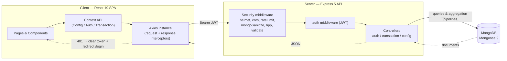

# Expense Tracker MERN — Step-by-Step Build Guide

> **Archived: original build playbook.** This document is the original roadmap used to build the Expense Tracker MERN application. It captures the intended implementation order, the decisions behind each layer, and the acceptance criteria for every step. The codebase may have evolved since this guide was written, so treat it as a making-of narrative rather than a live specification. For current setup, architecture, and deployment notes, see [../README.md](../README.md).

---

> **Project Summary:** Expense Tracker MERN is a full-stack personal finance application. A single authenticated user role can register, log in, and manage income/expense transactions with full CRUD, ownership isolation, advanced filtering (month, category, type), and server-side pagination. The dashboard surfaces Mongoose aggregation pipelines as summary cards, a monthly income-vs-expense bar chart, and a category breakdown pie chart, all auto-refreshing after CRUD operations. The backend is security-hardened with Helmet, a CORS whitelist, global and auth-specific rate limiting, NoSQL injection sanitization, HPP protection, body-size limits, and bcrypt password hashing. Categories and transaction types are served from a single `/api/config` source of truth. Stack: React 19 + TypeScript + Vite 8 + Tailwind CSS 4 on the client; Express 5 + Mongoose 9 + MongoDB with JWT auth on the server; Jest + Supertest + mongodb-memory-server for integration tests; Swagger/OpenAPI for documentation.

Each step below is a self-contained prompt. Execute them in order.

Stack: React 19, TypeScript 5.9, Vite 8, Tailwind CSS 4, React Router 7, Recharts 3, Axios; Node.js, Express 5, Mongoose 9, MongoDB, jsonwebtoken, bcryptjs, express-validator, Helmet, express-rate-limit, express-mongo-sanitize, hpp; Jest 30, Supertest 7, mongodb-memory-server 11; ESLint 9 + Prettier.

---

## Table of Contents

**PHASE 1 — Backend Foundation**

- STEP 1 — Project Scaffolding & Dependency Setup
- STEP 2 — Environment Validation & Server Entry Point
- STEP 3 — Express App Composition & Security Middleware
- STEP 4 — Global Error Handling

**PHASE 2 — Backend Resources**

- STEP 5 — User Model & Password Hashing
- STEP 6 — JWT Utilities & Auth Middleware
- STEP 7 — Auth Validators, Controller & Routes
- STEP 8 — Transaction Model & Shared Domain Constants
- STEP 9 — Transaction Controller (CRUD + Aggregations)
- STEP 10 — Transaction Validators & Routes
- STEP 11 — Config Endpoint (Single Source of Truth)
- STEP 12 — Swagger Docs & Welcome Page
- STEP 13 — Integration Tests (Jest + Supertest)

**PHASE 3 — Client Foundation**

- STEP 14 — Vite + TypeScript + Tailwind Scaffolding
- STEP 15 — Shared Types & Domain Constants
- STEP 16 — Axios Instance & Interceptors
- STEP 17 — Service Layer
- STEP 18 — Config, Auth & Transaction Contexts
- STEP 19 — Routing & Protected Routes

**PHASE 4 — Client Pages**

- STEP 20 — App Layout, Navbar & Footer
- STEP 21 — Public Pages (Home, Login, Register)
- STEP 22 — Dashboard (Summary + Charts + Recent)
- STEP 23 — Transactions (Filter, List, Form)
- STEP 24 — Reusable UI Components & Hooks

**PHASE 5 — Polish & Deploy**

- STEP 25 — Validation, Accessibility & Toasts
- STEP 26 — Linting, Formatting & Quality Gates
- STEP 27 — Deployment (Render + Netlify)

**Appendices**

- Appendix A — Shared Constants
- Appendix B — Reusable Patterns
- Appendix C — Common Pitfalls
- Appendix D — Pre-flight Checklist

---

## Global Build Rules (apply to EVERY step)

- **No git operations.** Do not run `git` commands, do not commit, and do not push. Version control is handled manually by the user.
- Do not install packages that are not listed in the relevant step. Prefer native methods over new dependencies.
- Do not start long-running processes (dev servers, watchers) unless the step explicitly requires it.
- Treat every step as self-contained: it states its goal, the files it touches, any new dependencies, implementation notes, and an acceptance checklist.
- Keep code clean, readable, and modern (ES6+, React Hooks, async/await). Use English, descriptive, camelCase identifiers.
- Prioritize security, accessibility (a11y), and performance in every layer.
- Follow DRY: extract shared constants, helpers, and patterns instead of duplicating logic.
- Backend uses CommonJS (`require`/`module.exports`); frontend uses ES modules + TypeScript strict mode.

---

## Architecture at a Glance

The system is a classic two-tier MERN split: a React SPA talks to an Express REST API over JWT-authenticated HTTP, and the API persists to MongoDB via Mongoose.



---

# PHASE 1 — BACKEND FOUNDATION

---

## STEP 1 — Project Scaffolding & Dependency Setup

**Goal:** Establish the monorepo with a `server/` workspace and install backend dependencies.

**Files/folders:**

- `server/package.json` (`"type": "commonjs"`, scripts: `dev`, `start`, `test`, `lint`, `lint:fix`, `format`, `format:check`)
- `server/src/` directory tree: `config/`, `controllers/`, `middleware/validators/`, `models/`, `routes/`, `utils/`, `__tests__/`

**Dependencies:**

```bash
cd server
npm install express mongoose dotenv jsonwebtoken bcryptjs cors helmet hpp express-rate-limit express-validator express-mongo-sanitize date-fns swagger-jsdoc swagger-ui-express
npm install -D nodemon jest supertest mongodb-memory-server eslint @eslint/js eslint-config-prettier globals prettier
```

**Implementation notes:**

- Scripts: `dev` → `nodemon src/index.js`; `start` → `node src/index.js`; `test` → `jest --forceExit --detectOpenHandles`.
- Keep `src/index.js` (process bootstrap) separate from `src/app.js` (Express composition) so tests can import the app without opening a real DB connection or port.

**Acceptance:** `npm run dev` fails gracefully with a clear "missing env" message (implemented in STEP 2); folder structure exists.

---

## STEP 2 — Environment Validation & Server Entry Point

**Goal:** Fail fast at startup if configuration is missing, then connect to MongoDB and listen.

**Files:** `server/src/index.js`, `server/.env.example`

**Implementation notes:**

- Load `dotenv` first.
- Validate required vars: `PORT`, `MONGO_URI`, `JWT_SECRET`, `JWT_EXPIRES_IN`, `CLIENT_URL`. If any are missing, `console.error` the list and `process.exit(1)`.
- Only after validation, `require('./app')`, connect with Mongoose, then `app.listen(PORT)`.
- Enable `mongoose.set('debug', NODE_ENV !== 'production')`.
- On connection error, log and `process.exit(1)`.

`server/.env.example`:

```env
PORT=5000
MONGO_URI=mongodb://localhost:27017/expense-tracker
JWT_SECRET=replace_with_a_strong_random_string_min_32_chars
JWT_EXPIRES_IN=7d
CLIENT_URL=http://localhost:5173
```

**Acceptance:** Server boots and logs "MongoDB connected successfully" + "Server running on port 5000" with a valid `.env`; exits with a descriptive message otherwise.

---

## STEP 3 — Express App Composition & Security Middleware

**Goal:** Build the hardened middleware stack and mount routes.

**Files:** `server/src/app.js`

**Implementation notes (order matters):**

1. `helmet()` for secure headers.
2. `cors({ origin: process.env.CLIENT_URL, credentials: true })`.
3. `express.json({ limit: '10kb' })` and `express.urlencoded({ extended: false, limit: '10kb' })`.
4. A small middleware that sanitizes **only `req.body`** with `express-mongo-sanitize`'s `sanitize()` — see Appendix C for why `req.query` must not be mutated under Express 5.
5. `hpp()`.
6. Rate limiters guarded by `if (process.env.NODE_ENV !== 'test')`: a global limiter (100 / 15 min) and an auth limiter (20 / 15 min) mounted on `/api/auth`.
7. `GET /` → welcome HTML page; `/api-docs` → Swagger UI.
8. `app.use('/api', routes)`.
9. `notFound` then `errorHandler` last.

Export the app with `module.exports = app`.

**Acceptance:** App module imports without side effects (no DB/port); security headers present on responses.

---

## STEP 4 — Global Error Handling

**Goal:** Centralize 404 and error responses; never leak stack traces in production.

**Files:** `server/src/middleware/errorHandler.js`

**Implementation notes:**

- `notFound` → 404 `{ message: 'Route not found' }`.
- `errorHandler(err, req, res, next)` handles:
  - Mongoose `CastError` → 400 "Invalid ID format".
  - Mongoose `ValidationError` → 400 with mapped field messages.
  - Mongo duplicate key (`err.code === 11000`) → 409 with a field-aware message derived from `err.keyValue`/`err.keyPattern` (e.g. `email already in use`).
  - Otherwise resolve a status code; in dev return `message` + `stack`, in production return a safe message and log the error.

**Acceptance:** Unknown routes return 404 JSON; thrown errors map to correct status codes; production responses omit stacks.

---

# PHASE 2 — BACKEND RESOURCES

---

## STEP 5 — User Model & Password Hashing

**Goal:** Define the `User` schema with secure password storage.

**Files:** `server/src/models/User.js`

**Implementation notes:**

- Fields: `name` (required, trim, max 50), `email` (required, unique, lowercase, trim, max 100), `password` (required, min 8, `select: false`).
- `pre('save')` hook: skip if password unmodified, else `bcrypt.genSalt(12)` + hash.
- Instance method `comparePassword(candidate)` returns a bcrypt comparison.
- `{ timestamps: true }`.

**Acceptance:** Saving a user hashes the password; `password` is excluded from queries by default; duplicate emails are rejected by the unique index.

---

## STEP 6 — JWT Utilities & Auth Middleware

**Goal:** Issue and verify tokens; protect private routes.

**Files:** `server/src/utils/generateToken.js`, `server/src/utils/verifyToken.js`, `server/src/middleware/auth.js`

**Implementation notes:**

- `generateToken(userId)` → `jwt.sign({ userId }, JWT_SECRET, { expiresIn: JWT_EXPIRES_IN || '7d' })`. Never include sensitive data in the payload.
- `verifyToken(token)` → returns decoded payload or `null` on any error (do not leak JWT error specifics).
- `authenticate` middleware: require `Authorization: Bearer <token>`, verify, load `User.findById(decoded.userId)`, attach `req.user`, else respond 401 `{ message: 'Not authorized' }`.

**Acceptance:** Valid tokens grant access; missing/malformed/expired tokens return 401.

---

## STEP 7 — Auth Validators, Controller & Routes

**Goal:** Implement register, login, and getMe with server-side validation.

**Files:** `server/src/middleware/validators/authValidator.js`, `server/src/middleware/validate.js`, `server/src/controllers/authController.js`, `server/src/routes/authRoutes.js`

**Implementation notes:**

- `validate.js`: run `validationResult`, and on errors return 400 `{ errors: [{ field, message }] }`.
- `registerRules`: `name` (trim, notEmpty, max 50), `email` (isEmail, normalizeEmail), `password` (length 8–128). Do **not** `.escape()` free-text fields (see Appendix C).
- `loginRules`: `email` valid, `password` notEmpty + max 128.
- `register`: optional pre-check for existing email → 409; create user; return `{ user: { id, name, email }, token }` with 201. The 11000 handler in STEP 4 covers race conditions.
- `login`: find user `.select('+password')`, compare password, return 401 "Invalid credentials" on failure, else `{ user, token }`.
- `getMe`: return `req.user` essentials.
- Routes: `POST /register`, `POST /login`, `GET /me` (authenticated).

**Acceptance:** Registration/login return tokens; invalid input returns 400; duplicate email returns 409; `/me` requires auth.

---

## STEP 8 — Transaction Model & Shared Domain Constants

**Goal:** Define the `Transaction` schema and expose domain constants from one place.

**Files:** `server/src/models/Transaction.js`

**Implementation notes:**

- Constants: `TRANSACTION_TYPES = ['income','expense']`, `CATEGORIES` (food, salary, transport, entertainment, health, education, shopping, bills, other), plus `INCOME_CATEGORIES` and `EXPENSE_CATEGORIES`.
- Schema fields: `type` (enum), `amount` (min 0.01), `category` (enum, trim), `description` (trim, max 200), `date` (default now), `userId` (ObjectId ref `User`, required). `{ timestamps: true }`.
- Add compound index `{ userId: 1, date: -1 }` for fast user-scoped, date-sorted queries.
- Attach the constants to the model (`Transaction.CATEGORIES = ...`) so validators, controllers, and the config endpoint share one definition.

**Acceptance:** Invalid type/category/amount rejected by schema validation; queries on `userId + date` use the index.

---

## STEP 9 — Transaction Controller (CRUD + Aggregations)

**Goal:** Implement user-scoped CRUD and the three dashboard aggregation endpoints.

**Files:** `server/src/controllers/transactionController.js`

**Implementation notes:**

- `pickFields(source, whitelist)` helper to prevent mass assignment; whitelist `['type','amount','category','description','date']`. Always set `userId` from `req.user._id`.
- `createTransaction`, `getTransactionById`, `updateTransaction`, `deleteTransaction` — every query filters by `{ _id, userId }`; validate ObjectId with `mongoose.isValidObjectId`; 404 when not found (this also enforces ownership isolation).
- `getTransactions`: optional `month` (regex `^\d{4}-(0[1-9]|1[0-2])$`), `category`, `type` filters; clamp `limit` to 1..100 (default 50) and `page` to >= 1; run `find().sort({ date: -1 }).skip().limit()` and `countDocuments` in `Promise.all`; return `{ transactions, pagination }`.
- `getSummary`: `$match` by userId (+ optional month) then `$group` by `type`; reduce into `{ totalIncome, totalExpense, netBalance }`.
- `getMonthlyBreakdown`: optional `type`/`year`; `$group` by `{ month, year, type }`, sort, project.
- `getCategoryBreakdown`: optional `type`/`month`; `$group` by `category`, sort by total desc, project.
- Convert `req.user._id` to `new mongoose.Types.ObjectId(...)` inside aggregation `$match` stages.

**Acceptance:** CRUD works only on owned records; aggregations return correct totals scoped to the user.

---

## STEP 10 — Transaction Validators & Routes

**Goal:** Validate transaction input and wire routes behind auth.

**Files:** `server/src/middleware/validators/transactionValidator.js`, `server/src/routes/transactionRoutes.js`

**Implementation notes:**

- `createTransactionRules`: `type` in `TRANSACTION_TYPES`; `amount` float `gt: 0, max: 999999999.99`; `category` in `CATEGORIES`; `description` optional, trim, max 200; `date` optional ISO 8601 with a custom "not in the future" check. Do not `.escape()` (Appendix C).
- `updateTransactionRules`: same fields, all `optional()`.
- Routes: `router.use(authenticate)` first, then `GET /`, `GET /summary`, `GET /monthly`, `GET /categories`, `GET /:id`, `POST /`, `PUT /:id`, `DELETE /:id`. Place specific paths (`/summary`, `/monthly`, `/categories`) before `/:id`.

**Acceptance:** All transaction routes require auth; invalid payloads return 400 with field errors.

---

## STEP 11 — Config Endpoint (Single Source of Truth)

**Goal:** Serve categories and types so the frontend never duplicates them.

**Files:** `server/src/controllers/configController.js`, `server/src/routes/configRoutes.js`, `server/src/routes/index.js`

**Implementation notes:**

- `getConfig` returns `{ transactionTypes, categories, incomeCategories, expenseCategories }` from the Transaction model constants.
- Central router (`routes/index.js`) mounts `/health` (returns `{ status, timestamp }`), `/auth`, `/transactions`, `/config`.

**Acceptance:** `GET /api/config` returns the domain lists; `GET /api/health` returns ok.

---

## STEP 12 — Swagger Docs & Welcome Page

**Goal:** Provide interactive API docs and a friendly root page.

**Files:** `server/src/config/swagger.js`, `server/src/config/welcomePage.js`

**Implementation notes:**

- Build an OpenAPI 3.0 spec with `swagger-jsdoc`; serve via `swagger-ui-express` at `/api-docs` (hide the topbar, set a custom site title).
- `getWelcomePage()` returns a small HTML page describing the API; served at `/`.

**Acceptance:** `/api-docs` renders Swagger UI; `/` returns the welcome page.

---

## STEP 13 — Integration Tests (Jest + Supertest)

**Goal:** Cover auth and transaction flows against an in-memory MongoDB.

**Files:** `server/src/__tests__/setup.js`, `server/src/__tests__/auth.test.js`, `server/src/__tests__/transaction.test.js`, `server/jest.config.js`

**Implementation notes:**

- `setup.js`: set test env vars (`JWT_SECRET`, `JWT_EXPIRES_IN`, `CLIENT_URL`, `NODE_ENV=test`); export `connectDB` (spins up `MongoMemoryServer`), `disconnectDB`, `clearDB`.
- Use `beforeAll(connectDB)`, `afterEach(clearDB)`, `afterAll(disconnectDB)`.
- Auth tests (14): register success/validation/duplicate, login success/failures, getMe with/without token.
- Transaction tests (18): CRUD, pagination, filters, summary, and a user-isolation test asserting one user cannot read another's transaction (expects 404).

**Acceptance:** `npm test` passes 32/32. Note: the first run may download the in-memory MongoDB binary; re-run if it times out (Appendix C).

---

# PHASE 3 — CLIENT FOUNDATION

---

## STEP 14 — Vite + TypeScript + Tailwind Scaffolding

**Goal:** Create the React + TS client with Tailwind v4 and a `@` alias.

**Files:** `client/package.json`, `client/vite.config.ts`, `client/tsconfig*.json`, `client/src/main.tsx`, `client/src/index.css`, `client/.env.example`

**Dependencies:**

```bash
cd client
npm install react react-dom react-router-dom axios recharts date-fns react-hot-toast @heroicons/react tailwindcss @tailwindcss/vite
npm install -D vite @vitejs/plugin-react typescript @types/react @types/react-dom @types/node eslint @eslint/js typescript-eslint eslint-plugin-react-hooks eslint-plugin-react-refresh globals
```

**Implementation notes:**

- `vite.config.ts`: add `react()` and `tailwindcss()` plugins; alias `@` → `./src`.
- `tsconfig.app.json`: strict mode, `noUnusedLocals`, `noUnusedParameters`, `paths: { "@/*": ["src/*"] }`.
- `index.css`: import Tailwind.
- `.env.example`: `VITE_API_URL=http://localhost:5000/api`.
- Mount `<App />` inside `<StrictMode>` in `main.tsx`.

**Acceptance:** `npm run dev` serves the SPA; Tailwind classes apply; `@/...` imports resolve.

---

## STEP 15 — Shared Types & Domain Constants

**Goal:** Centralize TypeScript interfaces and category/type style maps.

**Files:** `client/src/types/index.ts`, `client/src/constants/transaction.ts`

**Implementation notes:**

- `types/index.ts`: `User`, `AuthResponse`, `AuthState`, `AuthContextValue`, `Transaction`, `TransactionInput`, `Pagination`, response shapes, `SummaryResponse`, breakdown items, `TransactionFilters`, `TransactionState`, `TransactionContextValue` (include `dataVersion: number`), `AppConfig`, and a `HeroIcon` type.
- `constants/transaction.ts`: `getCategoryStyle()` and `getTypeStyle()` returning Tailwind class strings for badges.

**Acceptance:** Types compile under strict mode; style helpers return classes for every category/type.

---

## STEP 16 — Axios Instance & Interceptors

**Goal:** One configured HTTP client with auth injection and 401 handling.

**Files:** `client/src/services/api.ts`

**Implementation notes:**

- `axios.create({ baseURL: import.meta.env.VITE_API_URL, timeout: 10000 })`.
- Request interceptor: attach `Authorization: Bearer <token>` from `localStorage`.
- Response interceptor: on 401, clear `token`/`user` and redirect to `/login`; strip any `stack` field from error payloads; provide a generic message fallback.

**Acceptance:** Authenticated requests carry the token; a 401 clears storage and redirects.

---

## STEP 17 — Service Layer

**Goal:** Wrap API endpoints in typed functions.

**Files:** `client/src/services/configService.ts`, `client/src/services/transactionService.ts`

**Implementation notes:**

- `configService.getAppConfig()` → `GET /config`.
- `transactionService`: `getTransactions`, `createTransaction`, `updateTransaction`, `deleteTransaction`, `getSummary`, `getMonthlyBreakdown`, `getCategoryBreakdown`. Use a `cleanParams` helper to drop empty/undefined query params (Appendix B).

**Acceptance:** Each function returns typed data; empty filters do not produce stray query params.

---

## STEP 18 — Config, Auth & Transaction Contexts

**Goal:** Provide global state via Context + `useReducer`.

**Files:** `client/src/context/ConfigContext.tsx`, `client/src/context/AuthContext.tsx`, `client/src/context/TransactionContext.tsx`

**Implementation notes:**

- `ConfigContext`: load `/config` on mount; keep a `FALLBACK_CONFIG` for graceful degradation; expose `{ config, isLoaded }`.
- `AuthContext`: reducer with `SET_LOADING`, `LOGIN_SUCCESS`, `USER_LOADED`, `LOGOUT`; bootstrap via `GET /auth/me` when a token exists; expose `login`, `register`, `logout`.
- `TransactionContext`: reducer for list/summary/monthly/category/filters/pagination; a `dataVersion` counter incremented after every CRUD op; `useEffect`s that re-fetch transactions and summary on `[filters, dataVersion]`. Expose `dataVersion` in the context value so charts can depend on it (Appendix B). Wrap all callbacks in `useCallback`; surface errors with `react-hot-toast`.

**Acceptance:** Reload preserves auth via `/me`; CRUD updates list, summary, and (via `dataVersion`) charts; config drives dropdowns.

---

## STEP 19 — Routing & Protected Routes

**Goal:** Configure routes and guard private areas.

**Files:** `client/src/App.tsx`, `client/src/components/ProtectedRoute.tsx`

**Implementation notes:**

- Provider order: `ConfigProvider` → `BrowserRouter` → `AuthProvider` → `Toaster` → `Routes`.
- Public routes: `/`, `/login`, `/register`. Protected layout route wraps `TransactionProvider` + `AppLayout` with nested `/dashboard` and `/transactions`. Catch-all redirects to `/`.
- `ProtectedRoute`: show a spinner while `isLoading`; redirect to `/login` when unauthenticated; else render children.

**Acceptance:** Unauthenticated users are redirected; authenticated users reach the dashboard shell.

---

# PHASE 4 — CLIENT PAGES

---

## STEP 20 — App Layout, Navbar & Footer

**Goal:** Build the responsive shell with a collapsible sidebar.

**Files:** `client/src/components/layout/AppLayout.tsx`, `Navbar.tsx`, `Footer.tsx`

**Implementation notes:**

- `AppLayout`: fixed sidebar with `NavLink` items (Dashboard, Transactions), mobile overlay + slide-in transition, user info + logout, a header with a hamburger toggle, and an `<Outlet />` for page content. Use 44px touch targets.
- `Navbar`/`Footer`: shared across public pages.

**Acceptance:** Sidebar collapses on mobile and is static on desktop; navigation highlights the active route.

---

## STEP 21 — Public Pages (Home, Login, Register)

**Goal:** Landing page and auth forms.

**Files:** `client/src/pages/Home.tsx`, `Login.tsx`, `Register.tsx`

**Implementation notes:**

- Home: marketing hero with CTAs to login/register.
- Login/Register: controlled forms using the client validation helpers (STEP 25); call `useAuth().login/register`; show field errors and toast feedback; navigate to `/dashboard` on success.

**Acceptance:** Forms validate inputs, surface server errors, and authenticate successfully.

---

## STEP 22 — Dashboard (Summary + Charts + Recent)

**Goal:** Compose the dashboard from aggregation-driven widgets.

**Files:** `client/src/pages/Dashboard.tsx`, `components/dashboard/SummaryCards.tsx`, `MonthlyChart.tsx`, `CategoryChart.tsx`, `RecentTransactions.tsx`

**Implementation notes:**

- `SummaryCards`: income/expense/net cards with skeleton, empty, and error states.
- `MonthlyChart`: Recharts `BarChart` (income vs expense), transform raw `{ month, year, type, total }` into grouped chart rows; depend on `dataVersion` so it refreshes after CRUD (Appendix B/C).
- `CategoryChart`: Recharts `PieChart` with an income/expense tab; also depend on `[activeTab, fetchCategoryBreakdown, dataVersion]`.
- `RecentTransactions`: latest few rows.

**Acceptance:** Charts render real aggregated data and refresh automatically after add/edit/delete.

---

## STEP 23 — Transactions (Filter, List, Form)

**Goal:** Full transaction management UI.

**Files:** `client/src/pages/Transactions.tsx`, `components/transactions/FilterBar.tsx`, `TransactionList.tsx`, `TransactionForm.tsx`

**Implementation notes:**

- `FilterBar`: month picker (max = current month), category + type selects sourced from `ConfigContext`, and a clear-filters button.
- `TransactionList`: responsive desktop table + mobile cards, skeleton/empty/error states, and an accessible delete-confirmation dialog.
- `TransactionForm`: modal create/edit with the a11y hook (STEP 25), a type toggle, category select scoped to income/expense, amount/date/description fields, per-field validation, and submit handling via context.

**Acceptance:** Users can filter, paginate, create, edit, and delete; the form is keyboard- and screen-reader-friendly.

---

## STEP 24 — Reusable UI Components & Hooks

**Goal:** Extract shared primitives to keep pages DRY.

**Files:** `client/src/components/ui/` (`Skeleton.tsx`, `EmptyState.tsx`, `ErrorMessage.tsx`, `FormField.tsx`, `LoadingSpinner.tsx`, `Pagination.tsx`), `client/src/hooks/useMediaQuery.ts`, `useModalA11y.ts`

**Implementation notes:**

- `Skeleton` variants for cards, charts, and table rows; `EmptyState` and `ErrorMessage` with optional retry; `FormField` exposing `getInputClass` + `FieldError`; `Pagination` controls.
- `useMediaQuery` for responsive breakpoints; `useModalA11y` (STEP 25).

**Acceptance:** Pages reuse these components without duplicating markup.

---

# PHASE 5 — POLISH & DEPLOY

---

## STEP 25 — Validation, Accessibility & Toasts

**Goal:** Client validation utilities, modal accessibility, and consistent feedback.

**Files:** `client/src/utils/validation.ts`, `client/src/utils/formatCurrency.ts`, `client/src/utils/capitalize.ts`, `client/src/hooks/useModalA11y.ts`

**Implementation notes:**

- `validation.ts`: `validateEmail`, `validatePassword`, `validateName`, `validateAmount`, `validateCategory`, `validateDate`, `sanitizeFormData`, `extractErrorMessage` (handles `{ message }` and `{ errors: [...] }`, network/timeout cases, never exposes raw objects/stacks), plus a `VALIDATION_LIMITS` constant.
- `useModalA11y(onClose)`: Escape-to-close, focus trap on Tab/Shift+Tab, body scroll lock, auto-focus first element, and focus restoration on unmount.
- Mount `<Toaster />` once in `App.tsx`; use `toast.success/error` in context callbacks.

**Acceptance:** Forms validate consistently; modals trap focus and close on Escape; all actions give toast feedback.

---

## STEP 26 — Linting, Formatting & Quality Gates

**Goal:** Enforce code quality on both workspaces.

**Files:** `server/eslint.config.mjs`, `server/.prettierrc`, `client/eslint.config.js`

**Implementation notes:**

- Server: ESLint flat config for Node + Prettier compatibility; scripts `lint`, `lint:fix`, `format`, `format:check`.
- Client: ESLint flat config with `typescript-eslint`, `react-hooks`, and `react-refresh`; `npm run lint`.
- Run `npm run lint` in both and resolve issues; ensure `tsc -b` passes for the client build.

**Acceptance:** Both workspaces lint clean; client `npm run build` (`tsc -b && vite build`) succeeds.

---

## STEP 27 — Deployment (Render + Netlify)

**Goal:** Ship the API and SPA.

**Files:** `client/public/_redirects`

**Implementation notes:**

- **Backend (Render):** Web Service, Root `server`, Build `npm install`, Start `npm start`; set `NODE_ENV`, `PORT`, `MONGO_URI`, `JWT_SECRET`, `JWT_EXPIRES_IN`, `CLIENT_URL`; Health Check Path `/api/health`.
- **Frontend (Netlify):** Base `client`, Build `npm run build`, Publish `client/dist`; set `VITE_API_URL`; add `public/_redirects` (`/* /index.html 200`) for SPA routing.
- Ensure `CLIENT_URL` on the API exactly matches the Netlify origin (no trailing slash) so CORS succeeds.

**Acceptance:** API responds at the Render URL; SPA loads on Netlify and talks to the API without CORS errors.

---

# Appendix A — Shared Constants

Single source of truth lives in `server/src/models/Transaction.js` and is exposed through `GET /api/config`. The client mirrors only a `FALLBACK_CONFIG` for offline degradation.

```
TRANSACTION_TYPES = ['income', 'expense']

CATEGORIES = ['food', 'salary', 'transport', 'entertainment',
              'health', 'education', 'shopping', 'bills', 'other']

INCOME_CATEGORIES  = ['salary', 'other']
EXPENSE_CATEGORIES = ['food', 'transport', 'entertainment', 'health',
                      'education', 'shopping', 'bills', 'other']

Limits: amount 0.01 .. 999,999,999.99 | description <= 200 | name <= 50 | password 8..128
Pagination: default limit 50, max 100 (client list uses 10 per page)
```

---

# Appendix B — Reusable Patterns

- **`pickFields(source, whitelist)`** (server): build a new object containing only whitelisted keys to prevent mass assignment; always set `userId` server-side.
- **`cleanParams(filters)`** (client): strip `undefined`/`null`/`''` so Axios never sends empty query params.
- **`dataVersion` invalidation** (client): a counter incremented after each CRUD op. List, summary, **and both dashboard charts** include `dataVersion` in their effect dependencies so the whole dashboard stays in sync without manual refetch calls.
- **Ownership isolation**: every transaction query filters by `{ _id, userId }`, so "not found" doubles as "not yours".
- **One Axios instance**: all requests share interceptors for auth and 401 handling.
- **Reducer + `useCallback`**: contexts use `useReducer` for predictable state and memoized callbacks for stable references.

---

# Appendix C — Common Pitfalls

- **Express 5 + `express-mongo-sanitize`:** In Express 5, `req.query` is a read-only getter; mutating it throws. Sanitize **only `req.body`** in a custom middleware instead of using the library's default global mutation.
- **`express-validator` `.escape()` on free text:** Escaping `name`/`description` stores HTML entities (e.g. `O&#x27;Brien`) in the database, corrupting the displayed value. Omit `.escape()` on free-text fields; React already escapes on render.
- **Charts not refreshing after CRUD:** If chart effects only depend on their fetch function, they won't update after add/edit/delete. Include `dataVersion` in the dependency array and expose it from the context.
- **`mongodb-memory-server` first-run timeout:** The first `npm test` may download the MongoDB binary and exceed the 10s startup window. Re-run after the binary is cached.
- **CORS mismatch in production:** `CLIENT_URL` must equal the deployed frontend origin with no trailing slash or path.
- **Route ordering:** Mount `/summary`, `/monthly`, `/categories` before `/:id` so they aren't captured as IDs.
- **Async controllers under Express 5:** Rejected promises are forwarded to the error handler automatically; this behavior is Express-5-specific (Express 4 needed an `asyncHandler` wrapper).

---

# Appendix D — Pre-flight Checklist

- [ ] `server/.env` and `client/.env` created from their `.env.example` files.
- [ ] Strong `JWT_SECRET` (>= 32 chars) generated.
- [ ] MongoDB reachable (Atlas URI or local instance running).
- [ ] `cd server && npm install` and `cd client && npm install` completed.
- [ ] `cd server && npm test` → 32/32 passing.
- [ ] `cd server && npm run lint` and `cd client && npm run lint` clean.
- [ ] `cd client && npm run build` succeeds.
- [ ] Manual smoke test: register → login → add/edit/delete transaction → dashboard charts update → filter → paginate → logout.
- [ ] Production `CLIENT_URL` and `VITE_API_URL` point at the correct deployed origins.
